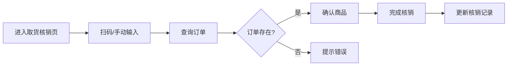

# 社区团购团长管理系统 PRD

## 1. 产品概述

社区团购团长管理系统是一款专为社区团购团长打造的日常运营管理工具，帮助团长高效管理商品预售、订单处理、取货核销、邻居维护和售后服务全流程。

- **核心价值**：简化团长日常操作，提升管理效率，降低差错率
- **目标用户**：社区团购团长、社区便利店店主、小区自提点管理员
- **解决痛点**：手工记账混乱、取货核销效率低、售后对账繁琐、客户信息难管理

## 2. 核心功能

### 2.1 用户角色

| 角色 | 登录方式 | 核心权限 |
|------|----------|----------|
| 团长 | 本地登录 | 商品管理、订单处理、核销操作、邻居管理、售后处理、数据统计 |

### 2.2 功能模块

1. **商品看板页**：日期切换、商品上架管理、限购设置、截单时间、取货点配置
2. **订单管理页**：订单列表、楼栋筛选、手机号尾号筛选、支付状态筛选
3. **取货核销页**：扫码核销、手动核销、未取货名单、核销记录
4. **邻居名单页**：邻居信息、常购品类、备注标签、黑名单管理
5. **售后管理页**：售后登记（缺货/破损/退款/补发）、当日金额汇总、供应商对账

### 2.3 页面详情

| 页面名称 | 模块名称 | 功能描述 |
|-----------|-------------|---------------------|
| 商品看板 | 日期导航栏 | 左右切换日期，快速跳转到今天 |
| 商品看板 | 商品列表卡片 | 展示商品图片、名称、价格、限购数量、已售数量 |
| 商品看板 | 上架操作区 | 新增商品、编辑商品、下架商品、设置截单时间 |
| 商品看板 | 取货点配置 | 设置取货地点、取货时间段 |
| 订单管理 | 筛选工具栏 | 楼栋选择、手机号尾号输入、支付状态切换 |
| 订单管理 | 订单列表 | 订单卡片展示商品、金额、收货人、楼栋房号、支付状态 |
| 订单管理 | 订单详情 | 展开查看完整订单信息、商品明细、备注 |
| 取货核销 | 扫码区域 | 模拟扫码输入框、快捷核销按钮 |
| 取货核销 | 手动核销 | 输入手机号或订单号查询核销 |
| 取货核销 | 未取名单 | 按楼栋分组展示未取货邻居清单 |
| 取货核销 | 核销记录 | 当日已核销列表、核销时间 |
| 邻居名单 | 搜索栏 | 按姓名/手机号搜索邻居 |
| 邻居名单 | 邻居卡片 | 头像、姓名、手机号、楼栋、常购品类标签 |
| 邻居名单 | 详情抽屉 | 完整信息、备注编辑、黑名单切换 |
| 售后管理 | 售后登记表单 | 选择类型（缺货/破损/退款/补发）、关联订单、金额、原因 |
| 售后管理 | 售后列表 | 当日售后记录、状态标签 |
| 售后管理 | 数据汇总卡片 | 当日应收、已收、待退、供应商对账金额 |
| 售后管理 | 供应商对账 | 按供应商分组展示供货金额、退款金额、应结算金额 |

## 3. 核心流程

### 3.1 商品上架与预售流程

团长登录系统后，选择预售日期，添加当日上架商品，设置价格、限购数量和截单时间，配置取货点信息，商品自动展示供邻居下单。

### 3.2 取货核销流程

邻居到自提点取货，团长通过扫码或手动输入订单号/手机号查询订单，确认商品后完成核销，系统记录核销时间。

### 3.3 售后处理流程

团长接到邻居售后申请，登记售后类型和原因，系统自动计算退款金额，汇总当日应收已收数据，生成供应商对账信息。

## 4. 用户界面设计

### 4.1 设计风格

- **主色调**：暖橙色系 (#FF7A45)，传达新鲜、活力、社区温暖的感觉
- **辅助色**：深青色 (#2D6A6A)，用于关键操作和强调
- **背景色**：米白暖灰 (#FAF8F5)，营造温馨舒适的视觉体验
- **按钮风格**：圆角矩形，渐变填充，微阴影，悬停有轻微上浮效果
- **字体**：标题使用"Noto Sans SC"，正文使用系统无衬线字体
- **布局风格**：卡片式布局，模块分明，左侧导航栏 + 顶部状态栏 + 主内容区
- **图标风格**：线性图标，统一 2px 描边，暖橙色为主
- **整体调性**：温暖、实用、亲切，贴近社区生活场景

### 4.2 页面设计概览

| 页面名称 | 模块名称 | UI 元素 |
|-----------|-------------|-------------|
| 商品看板 | 顶部日期栏 | 左右箭头切换、日期胶囊、今日高亮、取货点标签 |
| 商品看板 | 商品网格 | 卡片悬停放大、图片占位、价格标签、限购徽标、操作按钮 |
| 商品看板 | 统计条 | 今日商品数、已售件数、销售额、截单倒计时 |
| 订单管理 | 筛选栏 | 下拉选择、输入框、状态切换标签组 |
| 订单管理 | 订单列表 | 卡片式列表、楼栋标签、支付状态彩色圆点、金额强调 |
| 取货核销 | 扫码区 | 大输入框、扫码动画、核销按钮脉冲效果 |
| 取货核销 | 未取名单 | 楼栋分组折叠、姓名列表、未取数量红色徽标 |
| 邻居名单 | 搜索栏 | 搜索框、筛选标签、新增按钮 |
| 邻居名单 | 卡片网格 | 头像、姓名、楼栋标签、常购品类小标签 |
| 售后管理 | 汇总卡片 | 四宫格数据卡、金额大字、趋势小箭头 |
| 售后管理 | 售后列表 | 类型图标、金额、状态标签、时间 |

### 4.3 响应式设计

- **设计优先**：Desktop-first，以 1440px 宽度为基准设计
- **平板适配**：768px ~ 1024px，侧边栏可折叠，卡片网格自适应列数
- **手机适配**：375px ~ 767px，底部 Tab 导航替代侧边栏，单列布局
- **触控优化**：按钮最小高度 44px，列表项有足够的点击区域

### 4.4 交互动效

- **页面切换**：淡入 + 轻微位移动画
- **卡片悬停**：轻微上浮 + 阴影加深
- **按钮点击**：缩放反馈 (scale 0.97)
- **核销成功**：绿色对勾圆形动画
- **数据更新**：数字滚动变化效果
- **侧边导航**：当前项有橙色指示条滑动动画
