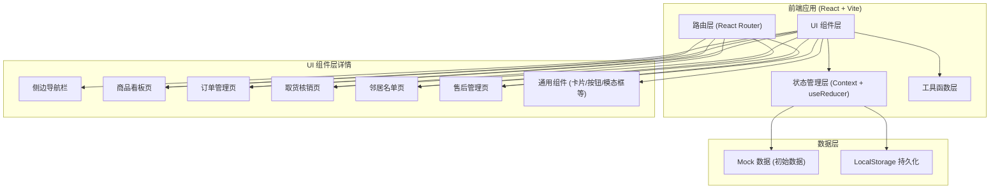
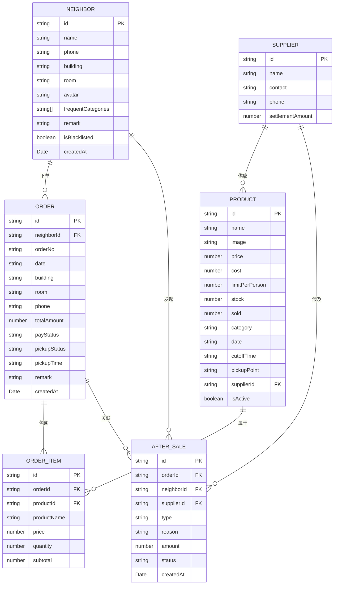

# 社区团购团长管理系统 技术架构文档

## 1. 架构设计



## 2. 技术选型说明

- **前端框架**：React@18 + TypeScript
- **构建工具**：Vite@5
- **样式方案**：TailwindCSS@3 + CSS 变量
- **路由管理**：React Router DOM@6
- **状态管理**：React Context + useReducer（轻量级，适合单用户本地应用）
- **数据持久化**：LocalStorage（本地存储，无需后端）
- **图标库**：Lucide React（轻量级线性图标）
- **日期处理**：date-fns（轻量级日期工具库）

### 为什么选择这些技术

1. **React + TypeScript**：组件化开发，类型安全，维护性强
2. **Vite**：极速开发体验，热更新快
3. **TailwindCSS**：快速开发，统一设计规范，响应式友好
4. **LocalStorage**：单用户本地应用，无需后端服务，开箱即用
5. **Lucide React**：图标风格统一，轻量高效

## 3. 路由定义

| 路由路径 | 页面名称 | 说明 |
|----------|----------|------|
| `/` | 商品看板 | 默认首页，展示当日预售商品 |
| `/products` | 商品看板 | 商品上架管理、日期切换 |
| `/orders` | 订单管理 | 订单列表、多维度筛选 |
| `/pickup` | 取货核销 | 扫码/手动核销、未取名单 |
| `/neighbors` | 邻居名单 | 邻居信息、常购品类、黑名单 |
| `/aftersale` | 售后管理 | 售后登记、数据汇总、供应商对账 |

## 4. 数据模型

### 4.1 实体关系图



### 4.2 数据结构定义

#### Product (商品)
```typescript
interface Product {
  id: string;
  name: string;
  image: string;
  price: number;
  cost: number;
  limitPerPerson: number;
  stock: number;
  sold: number;
  category: string;
  date: string;
  cutoffTime: string;
  pickupPoint: string;
  supplierId: string;
  isActive: boolean;
}
```

#### Order (订单)
```typescript
interface Order {
  id: string;
  neighborId: string;
  orderNo: string;
  date: string;
  building: string;
  room: string;
  phone: string;
  totalAmount: number;
  payStatus: 'unpaid' | 'paid' | 'refunded';
  pickupStatus: 'pending' | 'picked' | 'partial';
  pickupTime?: string;
  items: OrderItem[];
  remark?: string;
  createdAt: Date;
}

interface OrderItem {
  id: string;
  productId: string;
  productName: string;
  price: number;
  quantity: number;
  subtotal: number;
}
```

#### Neighbor (邻居)
```typescript
interface Neighbor {
  id: string;
  name: string;
  phone: string;
  building: string;
  room: string;
  avatar: string;
  frequentCategories: string[];
  remark: string;
  isBlacklisted: boolean;
  createdAt: Date;
}
```

#### AfterSale (售后)
```typescript
interface AfterSale {
  id: string;
  orderId: string;
  neighborId: string;
  supplierId: string;
  type: 'out_of_stock' | 'damaged' | 'refund' | 'reissue';
  reason: string;
  amount: number;
  status: 'pending' | 'processed' | 'closed';
  createdAt: Date;
}
```

#### Supplier (供应商)
```typescript
interface Supplier {
  id: string;
  name: string;
  contact: string;
  phone: string;
}
```

## 5. 状态管理设计

### 5.1 全局状态结构

```typescript
interface AppState {
  products: Product[];
  orders: Order[];
  neighbors: Neighbor[];
  afterSales: AfterSale[];
  suppliers: Supplier[];
  currentDate: string;
  ui: {
    sidebarCollapsed: boolean;
    activeModal: string | null;
  };
}
```

### 5.2 核心 Action 类型

```typescript
type AppAction =
  | { type: 'SET_CURRENT_DATE'; payload: string }
  | { type: 'ADD_PRODUCT'; payload: Product }
  | { type: 'UPDATE_PRODUCT'; payload: Product }
  | { type: 'DELETE_PRODUCT'; payload: string }
  | { type: 'UPDATE_ORDER_STATUS'; payload: { id: string; status: string } }
  | { type: 'PICKUP_ORDER'; payload: { id: string; time: string } }
  | { type: 'ADD_NEIGHBOR'; payload: Neighbor }
  | { type: 'UPDATE_NEIGHBOR'; payload: Neighbor }
  | { type: 'TOGGLE_BLACKLIST'; payload: string }
  | { type: 'ADD_AFTER_SALE'; payload: AfterSale }
  | { type: 'UPDATE_AFTER_SALE'; payload: AfterSale };
```

## 6. 目录结构

```
src/
├── components/          # 通用组件
│   ├── Layout/         # 布局组件（侧边栏、顶部栏）
│   ├── ui/             # 基础UI组件（按钮、卡片、模态框等）
│   └── charts/         # 图表组件
├── pages/              # 页面组件
│   ├── Products/       # 商品看板页
│   ├── Orders/         # 订单管理页
│   ├── Pickup/         # 取货核销页
│   ├── Neighbors/      # 邻居名单页
│   └── AfterSale/      # 售后管理页
├── context/            # React Context
│   └── AppContext.tsx
├── data/               # Mock 数据
│   └── mockData.ts
├── hooks/              # 自定义 Hooks
│   ├── useLocalStorage.ts
│   └── useDateNavigation.ts
├── types/              # TypeScript 类型定义
│   └── index.ts
├── utils/              # 工具函数
│   ├── date.ts
│   ├── format.ts
│   └── id.ts
├── App.tsx
├── main.tsx
└── index.css
```

## 7. 数据持久化方案

使用 LocalStorage 存储所有数据，Key 设计：

| Key | 说明 |
|-----|------|
| `tuanzhang_products` | 商品数据 |
| `tuanzhang_orders` | 订单数据 |
| `tuanzhang_neighbors` | 邻居数据 |
| `tuanzhang_aftersales` | 售后数据 |
| `tuanzhang_suppliers` | 供应商数据 |

**初始化逻辑**：应用启动时检测 LocalStorage 是否有数据，若无则加载 Mock 数据并写入 LocalStorage。

## 8. 核心功能实现思路

### 8.1 商品看板
- 日期切换使用 `date-fns` 计算
- 商品按日期筛选展示
- 限购数量、截单时间可编辑
- 取货点配置存储在单独设置中

### 8.2 订单筛选
- 楼栋筛选：下拉选择 + 多选
- 手机号尾号：输入后模糊匹配尾号
- 支付状态：标签切换筛选
- 使用 `useMemo` 优化筛选性能

### 8.3 取货核销
- 扫码：使用输入框模拟扫码枪输入
- 手动核销：支持订单号/手机号查询
- 未取名单：按楼栋分组，折叠/展开
- 核销状态实时更新

### 8.4 邻居管理
- 搜索：姓名/手机号模糊匹配
- 常购品类：标签形式展示，可编辑
- 黑名单：一键切换，视觉标记区分
- 详情抽屉：右侧滑出，完整信息编辑

### 8.5 售后与对账
- 售后类型：缺货/破损/退款/补发
- 金额自动计算：基于订单金额和售后类型
- 当日汇总：应收、已收、待退实时计算
- 供应商对账：按供应商分组统计

## 9. 性能优化

1. **列表虚拟化**：订单列表较多时使用虚拟滚动
2. **记忆化计算**：筛选、汇总逻辑使用 useMemo
3. **组件懒加载**：非首屏页面使用 React.lazy
4. **LocalStorage 节流**：频繁操作时节流写入
5. **图片优化**：使用占位图，实际图片懒加载
